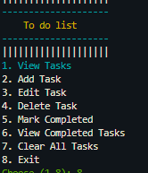

📌 To-Do List (Python CLI)

A structured and persistent **Command-Line To-Do List Application** built using Python.
This project stores tasks in JSON files and includes features like priorities, deadlines, daily tasks, task editing, completed-task tracking, and color-formatted CLI output.

⭐ Features

* Add tasks with:

  * Title
  * Priority (low / medium / high)
  * Description
  * Deadline (YYYY-MM-DD)
  * Option for daily tasks (no deadline required)
* Edit tasks without losing data
* Delete tasks individually
* Mark tasks as completed (tracked with completion date)
* Compare deadline vs completion date
* View all tasks in a clean, color-coded layout
* Persistent storage using JSON files
* Input validation for:

  * Dates
  * Priorities
  * Task numbers
  * Empty fields
 * Fully CLI-based

🏗️ Project Structure

ToDo-CLI/
│
├── todo.py            # Main CLI program
├── tasks.json         # Stores active/pending tasks
├── completed.json     # Stores completed tasks history
├── sss/               # Contains screenshots (optional folder)
└── README.md          # Documentation

🔧 Installation

1. Install Python

Download from: https://www.python.org/downloads/

2. Install Dependencies

Open a terminal inside the project folder:

pip install colorama

🚀 Run the Program

python todo.py

 📝 Usage

After running the script, you will see a menu:

1. View Tasks
2. Add Task
3. Edit Task
4. Delete Task
5. Mark Completed
6. Clear All Tasks
7. Exit

Choose any option by entering the corresponding number.

📂 Data Files

tasks.json

Stores all active tasks with fields:

* title
* priority
* description
* deadline or daily-task flag
* status

 completed.json

Stores completed tasks with:

* title
* original deadline
* priority
* completion date
* finished_before_deadline (true/false)

📸 Screenshots

Example:

🤝 Contributing

Feel free to contribute by creating issues or submitting pull requests.

📜 License

This project is open-source and free to use.

